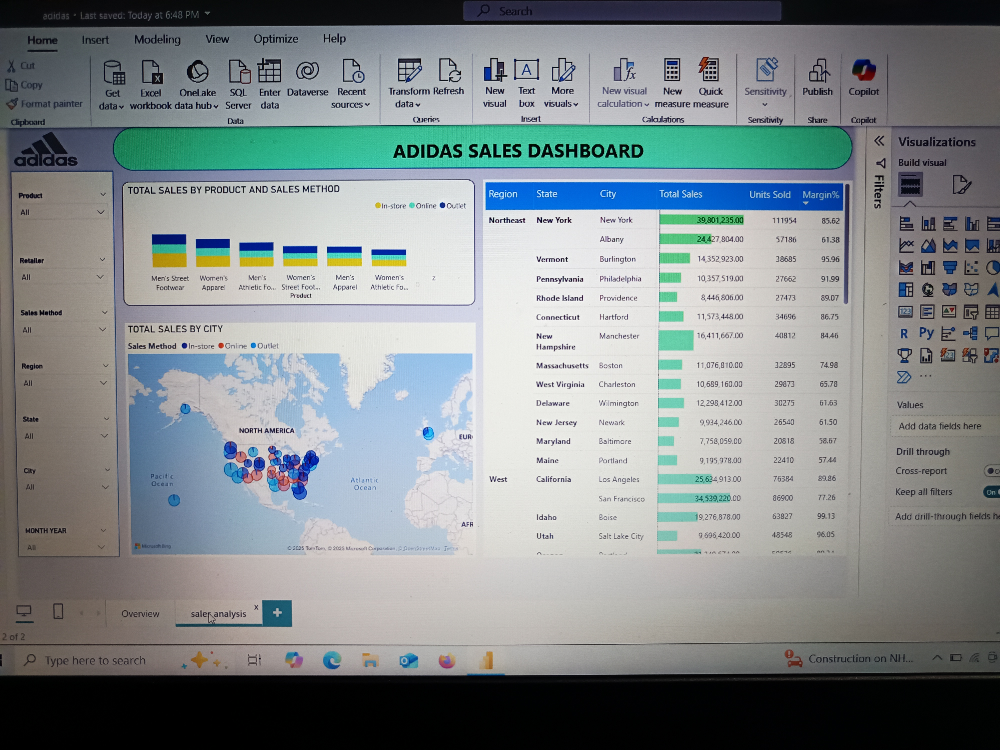

𝗔𝗱𝗶𝗱𝗮𝘀-𝘀𝗮𝗹𝗲𝘀-𝗱𝗮𝘀𝗵𝗯𝗼𝗮𝗿𝗱-𝗔𝗻𝗮𝗹𝘆𝘀𝗶𝘀

𝗢𝘃𝗲𝗿𝘃𝗶𝗲𝘄 𝗼𝗳 𝗸𝗲𝘆 𝗺𝗲𝘁𝗿𝗶𝗰𝘀:

𝗧𝗼𝘁𝗮𝗹 𝘀𝗮𝗹𝗲𝘀: 900M

𝗨𝗻𝗶𝘁𝘀 𝘀𝗼𝗹𝗱: 2,478,861

𝗢𝗽𝗲𝗿𝗮𝘁𝗶𝗻𝗴 𝗺𝗮𝗿𝗴𝗶𝗻: 42.30%

𝗧𝗼𝘁𝗮𝗹 𝘀𝗮𝗹𝗲𝘀 𝗯𝘆 𝗿𝗲𝗴𝗶𝗼𝗻 appears to be a bar chart

The chart displays the sum of total sales for each region, allowing for a direct comparison of sales performance across regions.

𝗦𝗮𝗹𝗲𝘀 𝘁𝗿𝗲𝗻𝗱𝘀 𝗼𝘃𝗲𝗿 𝘁𝗶𝗺𝗲:

A line graph depicting total sales by month, providing insights into seasonal trends and sales fluctuations throughout the year.

𝗧𝗼𝘁𝗮𝗹 𝘂𝗻𝗶𝘁𝘀 𝘀𝗼𝗹𝗱:

donut chart showing the distribution of online, outlet, and in-store sales.

Bar graphs for total sales achievements across quarters for 2020 and 2021.

𝗦𝗮𝗹𝗲𝘀 𝗯𝘆 𝗿𝗲𝗴𝗶𝗼𝗻: Another visualization showing total sales segmented by geographic regions.

𝗧𝗼𝘁𝗮𝗹 𝘀𝗮𝗹𝗲𝘀 𝗯𝘆 𝗺𝗼𝗻𝘁𝗵: A line graph illustrating sales trends over the months, showing fluctuations.

𝗧𝗼𝘁𝗮𝗹 𝘀𝗮𝗹𝗲𝘀 𝗯𝘆 𝗿𝗲𝘁𝗮𝗶𝗹𝗲𝗿:

A bar chart is likely being used to represent total sales by different retailers.

The visual helps in assessing which retailer contributed the most to total sales.

𝗟𝗶𝗻𝗲 𝗴𝗿𝗮𝗽𝗵𝘀:

Highlights seasonal variations and patterns in sales.

𝗧𝗼𝘁𝗮𝗹 𝘀𝗮𝗹𝗲𝘀 𝗯𝘆 𝗰𝗶𝘁𝘆:

A map displaying total sales by city in North America.
Colors represent different sales methods: In-store, Online, and Outlet.

𝗧𝗮𝗯𝗹𝗲 𝗺𝗮𝘁𝗿𝗶𝘅 𝘀𝗮𝗹𝗲𝘀 𝗱𝗮𝘁𝗮:

New York:
Total Sales: 39,801,253.00
Units Sold: 111,954
Margin Percentage: 85.62%

California (Los Angeles):
Total Sales: 2,654,913.00
Units Sold: 76380
Margin Percentage: 87.26%

𝗛𝗶𝗴𝗵𝗲𝘀𝘁 𝗽𝗲𝗿𝗳𝗼𝗿𝗺𝗶𝗻𝗴 𝗰𝗶𝘁𝘆: Newly York in terms of total sales.

