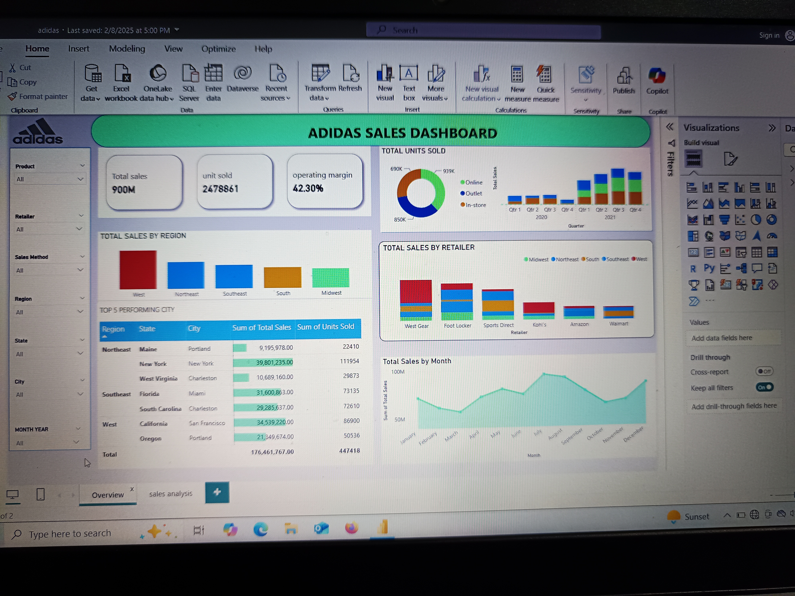

Adidas-sales-dashboard-Analysis

Overview of Key Metrics:

Total Sales: 900M

Units Sold: 2,478,861

Operating Margin: 42.30%

Total Sales by Region appears to be a bar chart

The chart displays the sum of total sales for each region, allowing for a direct comparison of sales performance across regions.

Sales Trends Over Time:

A line graph depicting total sales by month, providing insights into seasonal trends and sales fluctuations throughout the year.

Total units sold:

donut chart showing the distribution of online, outlet, and in-store sales.

Bar graphs for total sales achievements across quarters for 2020 and 2021.

Sales by Region: Another visualization showing total sales segmented by geographic regions.

Total Sales by Month: A line graph illustrating sales trends over the months, showing fluctuations.

Total Sales by Retailer:

A bar chart is likely being used to represent total sales by different retailers.

The visual helps in assessing which retailer contributed the most to total sales.

Line Graphs:

Highlights seasonal variations and patterns in sales.

Total Sales by City:

A map displaying total sales by city in North America.
Colors represent different sales methods: In-store, Online, and Outlet.

Table matrix Sales Data:

New York:
Total Sales: 39,801,253.00
Units Sold: 111,954
Margin Percentage: 85.62%

California (Los Angeles):
Total Sales: 2,654,913.00
Units Sold: 76380
Margin Percentage: 87.26%

Highest Performing City: New York in terms of total sales.

